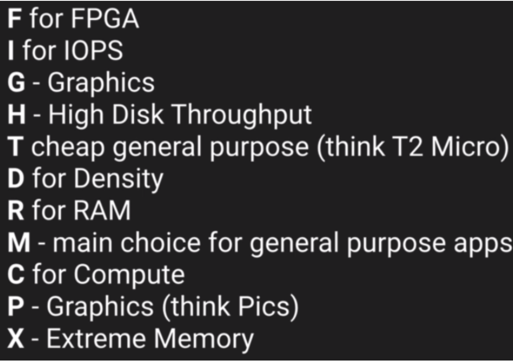

# AWS EC2

## EC2 Types

* On Demand - pay fixed rate by hour (or second) with no commitment
* Reserved - provides capacity reservation with significant discount on hourly charge - 1 Year or 3 Year terms
* Spot - enables you to bid whatever price you want for instance capacity, providing for even greater savings if your applications have flexibile start and end times
* Dedicated Hosts - physical EC2 server dedicated for your use. Can help reduce costs by allowing you to use existing server-bound software licenses


_On Spot Instances_:

If they are terminated by Amazon EC2, you will not be charged for a partial hour of usage. However, if you terminate the instance yourself, you will be charged forthe complete hour in which the instance ran.


## EC2 Instance Types


FIGHT DR MC PX:




## EBS Volume Types

**_SSD_**

* General Purpose SSD (<10,000 IOPS) - balances price and performance for wide variety of workloads
* Provisioned IOPS SSD (>10,000 IOPS) - highest-performance SSD volume for mission-critical low-latency or high-throughput workloads

**_MAGNETIC_**

* Throughput Optimized HDD - Low cost HDD volume designed for frequently accessed, throughput-intensive workloads
* Cold HDD - Lowest cost HDD volume designed for less frequently accessed workloads
* Magnetic - Previous Generation. Can be a boot volume.


## EC2 Lab Commands

Basic WebServer

```bash
sudo su [superuser access]
yum update -y [update ec2 instance]
uum install httpd -y [install apache server]
service httpd start [start apache server]
chkconfig httpd on [on ec2 restart server will auto restart]
service httpd status [check apache server status]
cd /var/www/html [change to server root directory]
vim index.html [create basic web page index file]
```
