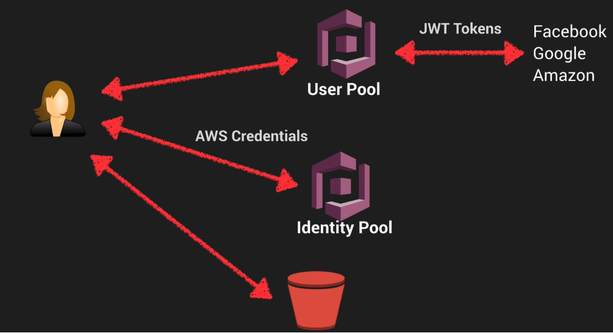
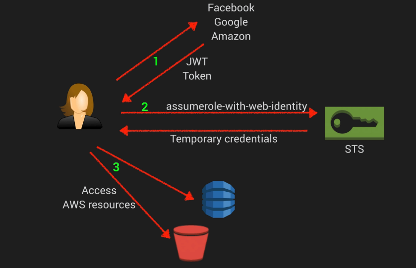
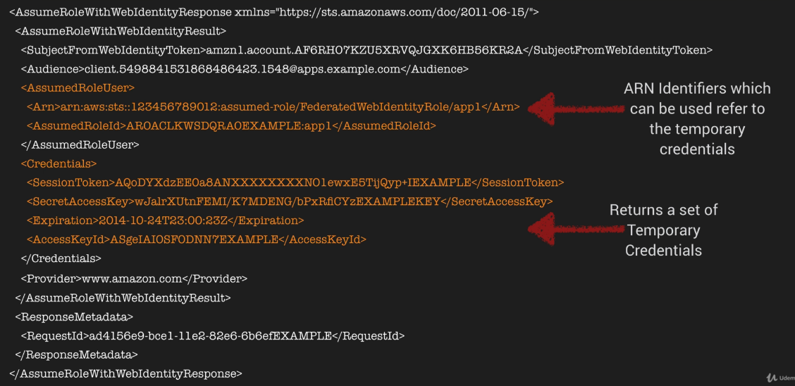

# AWS IAM

IAM consists of:

* Users
* Groups [Group users and apply policies collectively]
* Roles
* Policy Documents [JSON]


## Basics:

* IAM is universal - does not apply to regions at this time
* The ‘root account’ is account created when first setup your AWS account (complete admin access)
* New Users have no permissions when first created
* New Users are assigned Access Key ID & Secret Access Keys when first created
* These are not same as a password, you cannot use the key ID and secret access key to login to the AWS management console
* You can use this to access AWS via the APIs and CLI


## Account Setup:

* You only get to view Access Key ID & Secrete Access Key once. If lost, you have to regenerate them.
* Always setup Multifactor Authentication (MFA) on your root account
* You can create and customise your own password rotation policies

## Practical:


_Applying IAM role to EC2_:

Go to EC2 in UI
Select Actions/Instance-Settings/
Attach/Replace IAM role

_Modifying S3 within EC2_:

```bash
cd ~/.aws [contains config credentials]
aws s3 ls
aws s3 ls s3://experimenting-aws
echo "Hello v2 from EC2" > hello2.txt
aws s3 cp hello2.txt s3://experimenting-aws
```

## Exam Tips

* Roles allow you to not use Access Key ID’s and Secret Access Keys
* Roles are preferred from a security perspective
* Roles are controlled by policies
* You can change a policy on a role and it will take immediate affect
* You can attach and detach roles to running EC2 instances without having to stop or terminate these instances

# Advanced IAM

## Web Identity Federation

This lets you give your users access to AWS resources after they have successfully authenticated
with a web-based identity provider like Amazon, Facebook, or Google.

Following successful authentication, the user receives an authentication code from the Web ID provider,
which they can trade for temporary AWS security credentials.

## Amazon Cognito

Provides Web Identity Federation with the following features:

* Sign-up and sign-in to your apps
* Access for guest users
* Acts as an Identity Broker between your application and Web ID providers, so you don't need to write any additional code.
* Synchronizes user data for multiple devices
* Recommended for all mobile applications AWS services

## Cognito Use Cases

The recommended approach for Web Identity Federation using social media accounts like Facebook.

* Cognito brokers  between the app and Facebook or Google to provide temporary credentials which map to an IAM role
allowing access to the required resources.
* No need for the application to embe4d or store AWS credentials locally on the devices and it gives users a seamless experience
across all mobile devices.

## Web Identity Federation Exam Tips

* Federation allows users to authenticate with a Web Identity Provider (Google, Facebook, Amazon)
* The user authenticates first with the Web ID Provider and receives an auth token, which is exchanged
for temporary AWS credentials allowing them to assume an IAM role.
* Cognito is an Identity Broker which handles interaction between your applications and the Web Id provider
(You don't need to write your own code to do this)
    * Provides sign-up, sign-in, and guest user access
    * Syncs user data for a seamless experience across your devices
    * Cognito is the AWS recommended approach for Web ID Federation particularly for mobile apps

## Cognito User Pools

* User Pools are user directories used to manage sign-up and sign-in functionality for mobile and web apps.
* Users can sign-in directly to the User Pool, or indirectly via an identity provider like Facebook, Amazon or Google.
Cognito acts as an identity Broker between the ID provider and AWS. Successful authentication generates a number of JSON Web tokens (JWTs).
* Identity Pools enable you to create unique identities for your users and authenticate them with identity providers. With an identity, you
can obtain temporary, limited-privilege AWS credentials to access other AWS services.



## Push Synchronization

* Cognito tracks the association between user identity and the various different devices they sign-in from.
* In order to provide a seamless user experience for your app, Cognito uses Push Synchronization to push updates and Sync user data across multiple devices.
* Amazon SNS is used to send a silent push notification to all the devices associated with a given user identity whenever data stored in the cloud changes.

## Cognito Exam Tips

* Cognito uses User Pools to manage user sign-up and sign-in directly or via Web identity Providers
* Cognito acts as an Identity broker, handling all interaction with Web Identity Providers.
* Cognito uses Push Synchronization (with SNS) to send a silent push notification of user data updates to multiple device types associated with a user ID

# Inline Policies -v- Managed Policies -v- Customer Policies

Identity Access Management (IAM) is used to define user access permissions within AWS.

There are 3 different types of IAM policies available:

* Managed Policies
* Customer Managed Policies
* Inline Policies

## Managed Policies

A Managed Policy is an IAM policy which is created and administered by AWS.

AWS provide Managed Poliicies for common use cases based on job function e.g.
AmazonDynamoDBFullACcess, AWSCodeCommitPowerUser, AmazonEC2ReadOnlyAccess etc.

These AWS-provided policies allow you to assign appropriate permissions to your users,
groups and roles without having to write the policy yourself.

A single Managed Policy can be attached to multiple users, groups, or roles within the
same AWS account and across different accounts.

You cannot change the permissions defined in an AWS Managed Policy.

## Customer Managed Policies

A Customer Managed Policy is a standalone policy that you create and admin inside your own AWS ac
count. You can attach this policy to multiple users, groups, and roles - but only within your own account.

In order to create a Customer Managed Policy, you can copy an existing AWS Managed Policy and customize it to fit
the requirements of your organization.

Recommended for use cases where the existing AWS Managed Policies don't meet the needs of your environment.

## Inline Policies

An Inline Policy is an IAM policy which is actually embedded within the user, group, or role to which it applies.
There is a strict 1:1 relationship between the entity and the policy.

When you delete the user, group, or role in which the Inline policy is embedded, the policy will also be deleted.

In most cases, AWS recommends using Managed Policies over Inline Policies.

Inline Policies are useful when you want to be sure that the permissions in a policy are not inadvertently assigned to any other user,
group or role that the one for which they're intended. i.e. you are creating a policy that must only ever be attached to a single user, group, or role.

## Policy Exam Tips

* Remember the 3 diff types of IAM Policies:
    * Managed Policy - AWS-managed default Policies
    * Customer Managed Policy - Managed by you
    * Inline Policy - Managed by you and embedded in a single user, group, or role
* In most cases, AWS recommends using Managed Policies over Inline Policies

# STS AssumeRoleWithWebIdentity

* assume-role-with-web-identity is an API provided by STS (security token service)
* Returns temporary security credentials for users auth by a mobile or web application or using a Web ID Provider like Amazon, Facebook, Google etc.
* For mobile applications, Cognito is recommended
* Regular web applications can use the STS assume-role-with-web-identity API



Sample API Response



## Exam Tips STS AssumeRoleWithWebIdentity

* Part of the Security Token Service
* Allows users who have authenticated with a Web Identity provider to access AWS resources
* Once the user has authenticated, the application makes the assume-role-with-web-identity API call
* If successful, STS will return temporary credentials enabling acceess to AWS resources
* AssumedRoleUser ARN and AssumedRoleID - are used to programmatically reference the temporary credentials -
not an IAM role or user

## IAM Policy Simulator

* Test the effects of IAM policies before committing them to production
* Validate that the policy works as expected
* Test policies attached to existing users - great for troubleshooting an issue which you
suspect is IAM related
* https://policysim.aws.amazon.com

# Exam Tips - IAM Policy Simulator

* Test IAM permissions before you commit them to production
* Validate that the policy works as expected
* You can also test policies attached to existing users - great for troubleshooting
* https://policysim.aws.amazon.com
