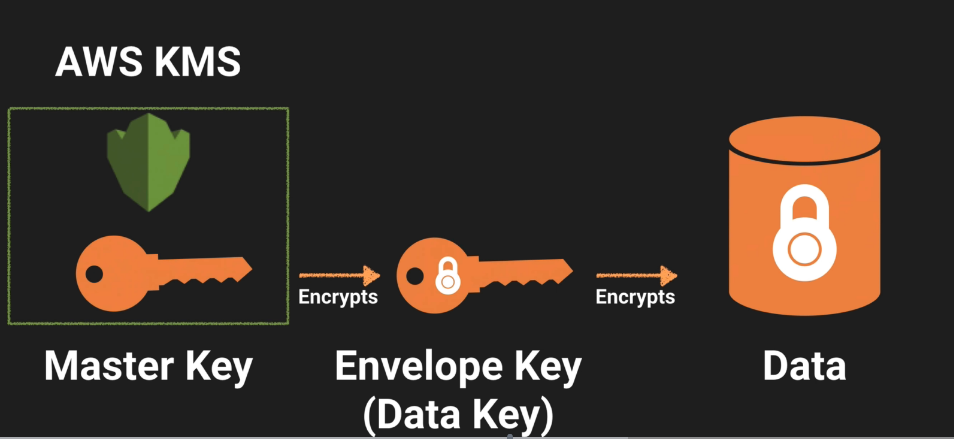

# AWS KMS

AWS Key Management Service is a managed service that makes it easy for you to
create and control the encryption keys used to encrypt your data.

AWS KMS is integrated with other services including EBS, S3, Redshift,
Elastic Transcoder, WorkMail, RDS & others to make it simple to encrypt
your data with encryption keys that you manage.

Encryption keys in AWS are regional (see IAM -> Encryption Keys to set region)

## The Customer Master Key (CMK):
* alias
* creation dataset
* description
* key state
* key material (either customer provided or AWS provided)
* Can never be exported

## Setup a CMK:
* Create Alias & description
* Choose material option...
* Define key Administrative permissions
  * IAM users/roles that can administer (but not use) the key through the KMS API
* Define key Usage permissions
  * IAM users/roles that can use the key to encrypt and decrypt data

## Key material options:
* Use KMS generated key material
* Your own key material

## KMS API Calls

1. Launch an EC2 instance (Create Key/Pair)
2. Click 'Encryption Keys' (IAM) -> Key Users
3. Users -> Encryptors Name -> Access Key -> Create access key (show secret access Key) -> copy/pasta
4. Grab public IP of EC2

To the CLI!
```
ssh ec2-user@public-ip-address -i MyKeyName.pem
sudo su

echo "hello world" > secret.txt
ls
cat secret.txt

aws configure
[pass in AWS Access Key ID]
[pass in AWS secret access key]
[default region name - for KMS]
[default output format - default]

aws kms encrypt --key-id YOURKEYIDHERE --plaintext fileb://secret.txt --output text --query CiphertextBlob | base64 --decode > encryptedsecret.txt
cat encryptedsecret.txt

aws kms decrypt --ciphertext-blob fileb://encryptedsecret.txt --output text --query Plaintext | base64 --decode > decryptedsecret.txt
cat decryptedsecret.txt

aws kms re-encrypt --destination-key-id YOURKEYIDHERE --ciphertext-blob fileb://encryptedsecret.txt | base64 > newencryption.txt
cat newencryption.txt

# will rotate the key every year
aws kms enable-key-rotation --key-id YOURKEYIDHERE
```

Note:
* Need to disable key & scheduled key deletion (min 1 week)

## Exam Tips
* aws kms encrypt
* aws kms decrypt
* aws kms re-encrypt
* aws kms enable-key-rotation

## KMS Envelope Encryption

The process of encrypting your Envelop (Data) key (the key used to decrypt your data)

* Customer Master Key used to decrypt the data key (envelope key)
* Envelope key is used to decrypt the data

### Envelope Encryption



### Decryption Process


## Exam Tips

The Customer Master key:

* Used to decrypt the data key (envelope key)
* Envelope key is used to decrypt the data

Note:
Cloud HSM is dedicated hardware.
