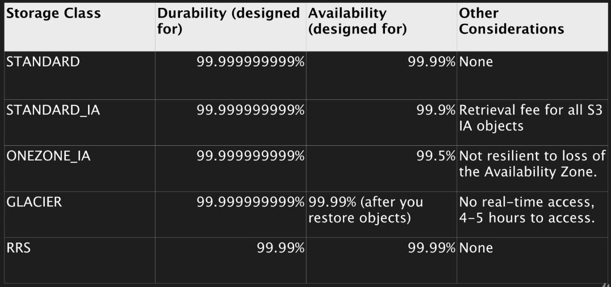

# AWS S3

Simple. Storage. Service.

S3 provides developers and IT teams with secure, durable, highly-scalable *object storage*.
Amazon S3 is easy to use with a simple web services interface to store and retrieve any amount
of data from anywhere on the web.

* S3 is a safe place to store your files.
* It is Object-based storage.
* The data is spread across multiple devices and facilities. (highly available)

## Basics

* S3 is Object-based - allows you to upload files.
* Files can be from 0 Bytes to 5 TB.
* There is unlimited storage.
* Files are stored in buckets (similar to a folder)
* S3 is a universal namespace. That is, names must be unique globally.
* Example: https://s3-eu-west-1.amazonaws.com/acloudguru
* When you upload a file to S3, you will receive a HTTP 200 code if upload was successful.

## Data Consistency Model for S3

* Read after Write consistency for PUTS of new Objects (once object added to S3, the file is available to read)
* Eventual Consistent to overwrite PUTs and DELETEs (can take some time to propagate)

S3 is a Simple Key-Value Store
* S3 is Object based. Objects consist of the following:
    * Key (This is simply the name of the Object)
    * Value (This is simply the data, which is made up of a sequence of bytes).
    * Version ID (important for versioning)
    * Metadata (Data about data you are storing)
    * Subresources - bucket-specific configuration:
        * Bucket Policies, Access Control Lists
        * Cross Origin Resource Sharing (CORS)
        * Transfer Acceleration

## S3 - The Basics

* Built for 99.99% availability for the S3 platform.
* Amazon Guarantee 99.9% availability
* Amazon guarantees 99.999999999% (11x9s) durability for S3 information.
* Tiered Storage Available
* Lifecycle Management
* Versioning
* Encryption
* Secure your data - Access
    * Control Lists & Bucket Policies

## S3 - Storage Tiers/Classes

* S3 99.99% availability, 11x9s durability, stored redundantly across multiple devices
in multiple facilities, and is designed to sustain the loss of 2 facilities concurrently.      
* S3 - IA (Infrequently Accessed): For data that is accessed less frequently, but requires
rapid access when needed. Lower fee than S3, but you are charged a retrieval fee.
* S3 - One Zone IA: Same as IA however data is stored in a single Availability Zone only, still
11x9s durability, but only 99.5% availability. Cost is 20% less than regular S3-IA.
* Reduced Redundancy Storage: Designed to provide 99.99% durability and 99.99% availability
of objects over a given year. Used for data that can be recreated if lost, e.g. thumbnails
(Starting to disappear from AWS docs but may still feature in exam) - Standard cost now more effective than using this option.
* Glacier: Very cheap, but used for archival only. Optimised for data that is infrequently accessed and
it takes 3-5 hours to restore from Glacier.



## S3 - Intelligent Tiering (re-invent 2018)

* Unknown or unpredictable access patterns
* 2 tiers - frequent & infrequent access
* Automatically moves your data to most cost-effective tier based on how frequently you access each object - If object
is not accessed for 30 consecutive days moved to infrequent access, but if it is used moved to frequent access.
* 11x9s durability
* 99,9% availability over a given year.
* Optimizes Cost
* No fees for accessing your data but a small monthly fee for monitoring/automation $0.0025 per 1,000 objects.

## S3 - Charges

* Storage per GB
* Requests (Get, Put, Copy, etc.)
* Storage Management Pricing
    * Inventory, Analytics, Object Tags
* Data Management Pricing
    * Data Transferred out of S3
* Transfer Acceleration
    * Use of CloudFront to optimize transfers

## S3 Exam Tips

* Remember that S3 is Object-based i.e. allows you to upload files. Object-based storage only (for files.)
* Not suitable to install an OS or running a DB on.
* Files can be from 0 Bytes to 5 TB.
* There is unlimited storage.
* Files are stored in Buckets.
* S3 is a universal namespace. That is, names must be unique globally.
    * Example: https://s3-eu-west-1.amazonaws.com/acloudguru
* Read after Write consistency for PUTS of new Objects
* Eventual Consistency for overwrite PUTS and DELETES (can take some time to propagate)
* S3 Storage Classes/Tiers
    * S3 [durable, immediately available, frequency accessed]
    * S3 - IA [durable, immediately available, infrequency accessed]
    * S3 - One Zone IA [same as IA however stored in single Availability Zone]
    * S3 Reduced Redundancy Storage [data that is easily reproducible i.e. thumbnails]
    * Glacier [Archived data, where you can wait 3-5 hours before accessing]
* Core fundamentals of S3 Object:
    * Key (name)
    * Value (data)
    * Version ID
    * Metadata
    * Subresources - bucket-specific config:
        * Bucket Policies, Access Control Lists
        * Cross Origin Resource Sharing (CORS)
        * Transfer Acceleration
* Successful uploads will generate  HTTP 200 status code - when you use CLI/API
* Make sure you read the S3 FAQ: https://aws.amazon.com/s3/faqs/

# S3 Security

## Securing Your Buckets

* By default, all newly created buckets are PRIVATE.
* You can set up access control to your buckets using:
    * Bucket Policies - Applied at a bucket level. (written in JSON)
    * Access Control Lists - Applied at an object level.
* S3 buckets can be configured to create access logs, which log all requests made to the s3 bucket.
These logs can be written to another bucket.

# S3 Encryption

## Types of Encryption

* In Transit:
    * SSL/TLS

* At Rest:
    * Server Side Encryption:
        * S3 Managed Keys - *SSE-S3* [AES-256]
        * AWS Key Management Service, Managed Keys, *SSE-KMS*
        * Server Side Encryption with Customer Provided Keys - *SSE-C*

* Client Side Encryption

## Enforcing Encryption on S3 Buckets

* Every time  a file is uploaded to S3, a PUT request is initiated.
* This is what a PUT request looks like:

```bash
PUT /myFileHTTP/1.1
Host: myBucket.s3.amazonaws.com
Date: Wed, 25 Apr 2018 09:50:00 GMT
Authorization: auth string
Content-Type: text/plain
Content-Length: 26880
x-amz-meta-author: Dan
Expect: 100-continue
[26880 bytes of object data]
```

* If the file is to be encrypted at upload time, the *x-amz-server-side-encryption-parameter*
will be included in the request header

* Two options are currently available:
    * x-amz-server-side-encryption: AES256 (SSE-S3 - S3 managed keys)
    * x-amz-server-side-encryption:ams:kms (SSE-KMS - KMS managed keys)

* When this parameter is included in the header of the PUT request, it tells S3 to
encrypt the object at the time of upload, using the specified encryption method.

* You can enforce the use of Server Side Encryption by using a Bucket Policy which denies any S3
PUT request which doesn't include the x-amz-server-side-encryption parameter in the request header.

The following request tells S3 to encrypt the file using SSE-S3 (AES 256) at the time of upload

```bash
PUT /myFileHTTP/1.1
Host: myBucket.s3.amazonaws.com
Date: Wed, 25 Apr 2018 09:50:00 GMT
Authorization: auth string
Content-Type: text/plain
Content-Length: 26880
x-amz-meta-author: Dan
Expect: 100-continue
x-amz-server-side-encrpytion: AES256
[26880 bytes of object data]
```

## Encryption Exam Tips

* Encryption In-Transit
    * SSL/TLS (HTTPS)
* Encryption At Rest
    * Server Side Encryption
        * SSE-S3
        * SSE-KMS
        * SSE-C
    * Client Side Encryption (encrypt locally before uploading)
* If you want to enforce use of encryption for files stored in S3, use an S3 Bucket Policy
to deny all PUT requests that don't include the x-amz-server-side-encryption parameter in the request header.

## CORS (Cross Origin Request Sharing)

A way of allowing code that is in one S3 bucket to access/reference code in another S3 bucket.
Allowing 1 resource to access another resource - hence CORS.

Useful for the 'static website hosting' property of S3.
Think - images referenced from another bucket on your site (when both s3 are public accessible).

* Go to the bucket containing site HTML -> Properties -> Endpoint. (copy)
* Go to external s3 Bucket -> Permissions -> CORS Configuration

This will provide the below default config - you will need to include your copied endpoint instead of 'asterisk' character':

```html
<CORSConfiguration>
    <CORSRule>
        <AllowedOrigin>*</AllowedOrigin>
        <AllowedMethod>GET</AllowedMethod>
        <MaxAgeSeconds>3000</MaxAgeSeconds>
        <AllowedHeader>Authorization</AllowedHeader>
    </CORSRule>
</CORSConfiguration>
```

## S3 Performance Optimization

S3 is designed to support very high request rates. however if your S3 buckets are routinely
receiving > 100 PUT/LIST/DELETE or >300 GET requests per second, then there are best practice guidelines to optimize.

The guidance is based on the type of workload you are running:

* GET-Intensive Workloads - use CloudFront content delivery service to get best performance.
CloudFront will cache your most frequently accessed objects and will reduce latency for your GET requests.

Note: see update 2018 below - this is no longer a major concern.
* Mixed Request Type Workloads - a mix of GET, PUT, DELETE, GET Bucket - they key names you use for your
objects can impact performance for intensive workloads.
    * S3 uses the key name to determine which partition an object will be stored in.
    * The use of sequential key names e.g. names prefixed with a time stamp or alphabetical sequence increases the
    likelihood of having multiple objects stored on the same partition
    * For heavy workloads this can cause I/O issues and contention
    * By using a random prefix to key names, you can force S3 to distribute your keys across multiple partitions,
    distributing the I/O workload.

## Key Name Example

The following Sequential Key Names are not optimal (likely stored on same partition):
* mybucket/date/custnum/photo1.jpg
* mybucket/date/custnum/photo2.jpg
* mybucket/date/custnum/photo3.jpg

Note: see update 2018 below - this is no longer a major concern.
For optimal performance, introduce some randomness into the key name e.g. prefix with 4-character hexadecimal hash.
* mybucket/6ef8-date/custnum/photo1.jpg
* mybucket/h35d-date/custnum/photo2.jpg
* mybucket/7eg4-date/custnum/photo3.jpg

## Update (2018)

* In July 2018, Amazon Announced massive increase in S3 performance that they can support
    * 3,500 PUT requests per second
    * 5,500 GET requests per second
* This new increased performances negates previous guidance to randomize your object key names to achieve faster performance.
* This means logical and sequential naming patterns can now be used without any performance implication.

## S3 Optimization Exam Tips

Remember 2 main approaches to Performance Optimization for S3:
* Get-Intensive -> CloudFront
* Mixed-Workloads -> Avoid sequential key names (maybe prefix with hex hash - avoids same partition)

Read S3 FAQ -> https://aws.amazon.com/s3/faqs/
